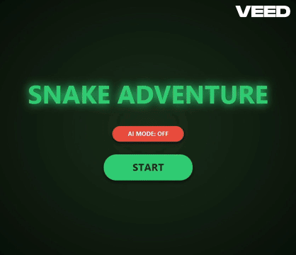
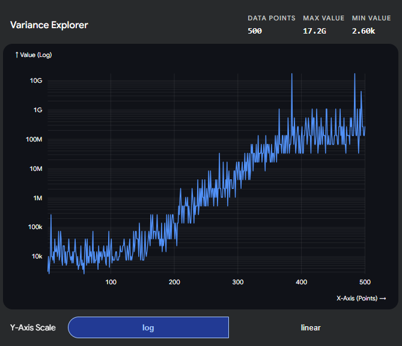

# 🐍 Snake Adventure

<p align="center">
  
</p>

<p align="center">
  
  
  
  
</p>

## 📦 Supported Platforms
**Windows:** `.exe` 

---
## 📖 About The Project

**Snake Adventure** started as a classic arcade game implementation developed in **Java** using the **JavaFX** framework, focusing on a clean UI and modular architecture.

The project has now evolved into a **Machine Learning experiment**, offering a dual experience for the user:

* **🎮 Manual Play:** You can test your own navigation skills in the classic game mode.
* **🤖 AI Demonstration:** The game features a **built-in, pre-trained AI agent**. You can watch in real-time as the neural network makes complex decisions, demonstrating survival strategies learned through hundreds of generations of artificial evolution.

The AI system is powered by a custom-built **Feedforward Neural Network** optimized via a **Genetic Algorithm**, demonstrating how autonomous agents can learn complex spatial tasks without any human-coded rules.

---

📁 For a deep dive into the AI code architecture, **[Access the Technical Documentation DOCX here](assets/Snake_AI_Documentation.docx)**

---

## 📈 Learning Curve
The graph below demonstrates the exponential growth of the AI's fitness score across generations, utilizing a logarithmic scale:

<p align="center">
  
</p> 

---

## 📜 Credits & License
All sound effects are used under the **[Mixkit Free License](https://mixkit.co/free-sound-effects/)**, which allows for use in personal and non-commercial projects, like this one.
_GIF created using [VEED.io](https://www.veed.io/)._
Created for **learning purposes** only.

---

## 🛠️ Local Development Setup
Follow these steps to set up and run this project using **IntelliJ IDEA**.

### 1. Clone the Repository
Open your terminal and run these commands:

```bash
git clone https://github.com/davidCrejenovschi/Snake.git
```

```bash
cd YourProjectName
```

### 2. Open in IntelliJ IDEA
1. Launch IntelliJ IDEA.
2. Select **Open** and navigate to the cloned project folder.
3. Select the `build.gradle` file and click **Open as Project**.
4. Wait for IntelliJ to automatically download Gradle and finish the sync.

### 3. Run the Application
You can run the project directly from the terminal using the Gradle wrapper.

**On Windows:**
```bash
.\gradlew.bat run
```

**On macOS / Linux:**
```bash
chmod +x gradlew
```

```bash
./gradlew run
```

